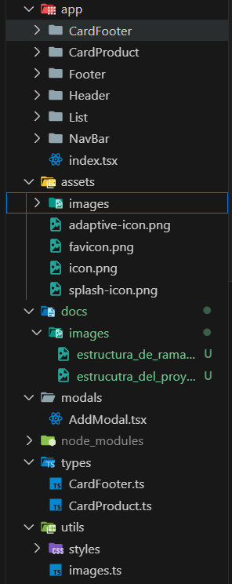
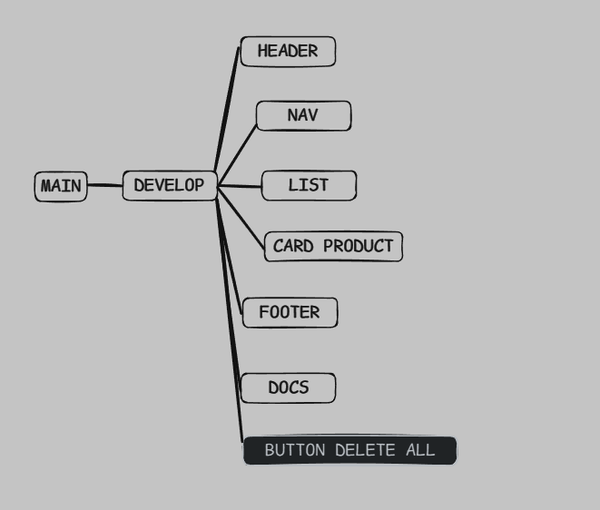

# PGL-MyList-Productos

Esta aplicación permite gestionar una lista personal de aires acondicionados.  
Cada producto tiene un **nombre**, **precio**, **categoría** e **imagen asociada**, y puede ser marcado como obtenido o eliminado individualmente.  
Además, la aplicación muestra contadores en tiempo real de:

- Número total de productos.
- Número de productos marcados.
- Precio total de los productos marcados.

También permite añadir nuevos productos mediante un modal con formulario, y eliminar todos los productos con un botón especial.

## Estructura del proyecto

## Estructura de ramas del repositorio

### Ejercicios Practicos

- [Ejercicio 1](./docs/preguntaUno.md)

- [Ejercicio 2](./docs/preguntaDos.md)

- [Ejercicio 3](./docs/preguntaTres.md)

- [Ejercicio 4](./docs/preguntaCuatro.md)
