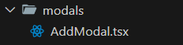
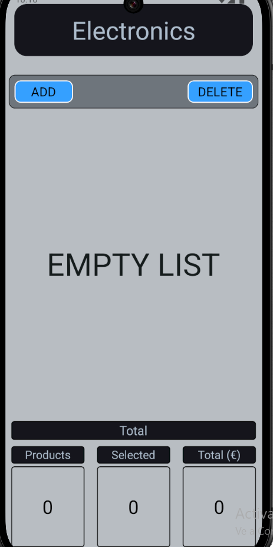
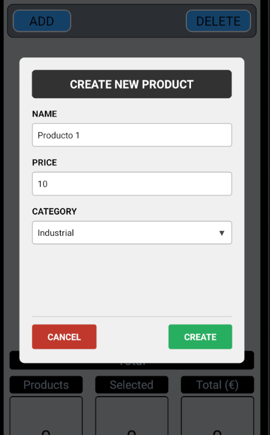
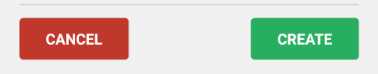
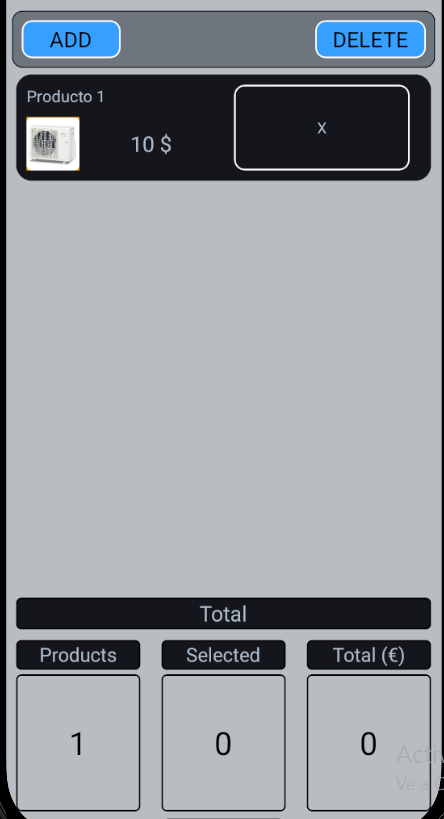
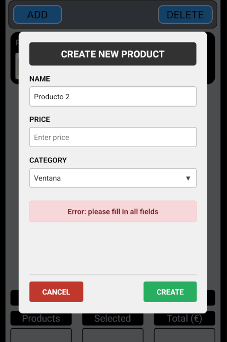

## 4. Componente modal

### Ubicacion componente addModal



### Formulario modal


### Lista vacia



### Ingreso de datos



### Opciones del modal



```
Selecciona `Cancel`: para cancelar la operacion

Selecciona `Create`: para agregar  el objeto a la lista
```

### Lista con objetos ingresados



### Respuesta de campos vacios



[<- Volver al inicio](../README.md)
