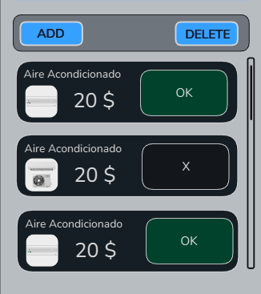
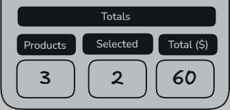
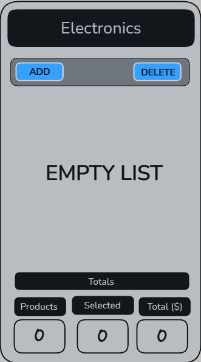
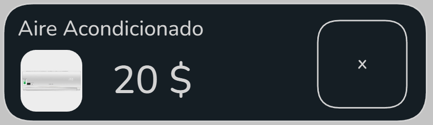
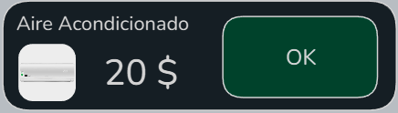
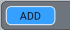
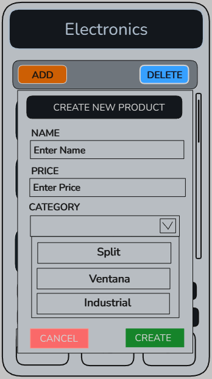
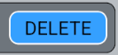
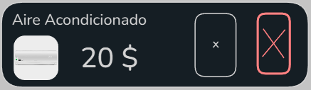

## Utilizando una herramienta como Excalidraw, diseña unas pantallas en las que:

### Muestres el listado de objetos, el número total de elementos de la lista, cuántos objetos hay marcados y el precio total que suman los marcados:

#### - Listado de objetos

#### - Numero total de elementos en la lista

#### - Cuantos objetos hay marcados

#### - Precio total que suman los marcados

### Lista vacia:

### Objeto(Producto):

#### - Objeto normal

#### - Objeto marcado

#### Categorias

#### - cassete

#### - industrial

#### - portatil

#### - split

#### - ventana

### Abrir modal

#### - Boton add para abrir el modal

#### - Mostrar Modal

### Mecanismo de eliminacion del objeto

#### - Boton delete para activar la eliminacion en los objetos

#### - Objeto con eliminacion

[<- Volver al inicio](../README.md)
